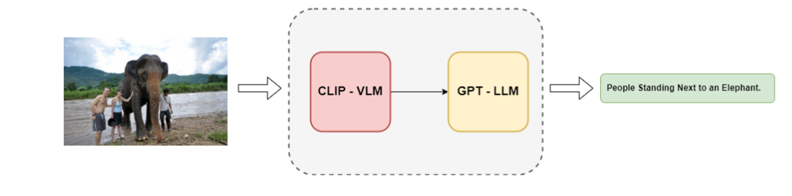
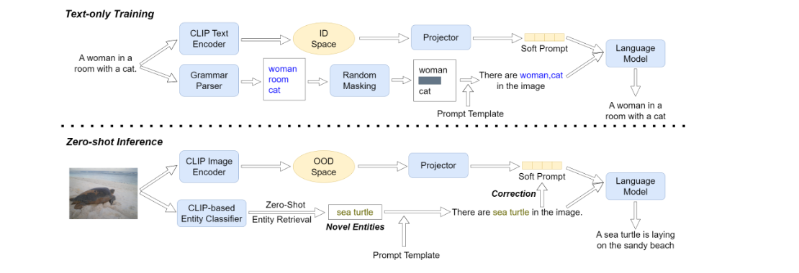
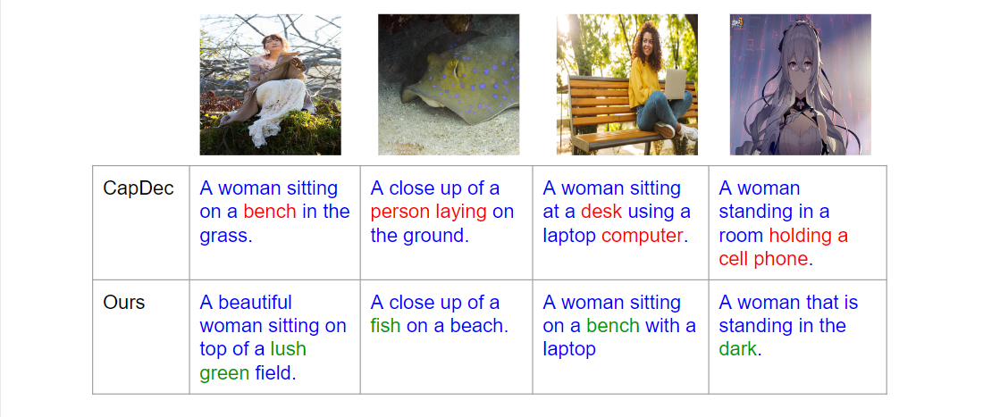

# Visual Entities Empowered Zero-Shot Image-to-Text Generation Transfer Across Domains

### Problem statement:
- Given an image I, the goal is to generate a textual description using a pre-trained Vision-Language Model (VLM) while leveraging real-world knowledge from a Large Language Model (LLM). 
- The primary focus is on addressing challenges related to *modality bias* and *object hallucination*.

### Method:

### Analysis:

# Code:

### requirements:

### Run

PPT Link: https://docs.google.com/presentation/d/1MY__ajJE0VolzEsR9XVgSn5Dtjhx1VWo4irGBco-WsY/edit#slide=id.g28910898772_1_38

If Checkpoints are needed to run the inference, We can share it privately.

Scripts folder help to train the model and Validation on dataset using bash script.

Code/Notebook folder contain the inference file that can be infer on one instance.

Code/Utils have general functionality function that frequently used by other codes.

Code/Feature Extraction folder contain the code that help to extract the text and image features from the CLIP model.

Code/Model contains the model architecture that we used for our approach.

Train and validation py files are present in the Code folder.

Logs folder contain the logs of experiments after running it.

annotations folder contain the downlaoded all dataset information, It's too large files. (We could not able to share in Git/Moodle.)  (If needed then we can share privately.)

checkpoints folder contain the checkpoints of each indiviual experiments that we have run generated captions of those experiments.

Evaluation folder is cloned from the standard MS COCO git repo, which widely used in Captioning task for the evaluation. 
Please clone this git repo. (https://github.com/tylin/coco-caption)

Latest Readme can be find at (https://github.com/RajGothi/GNR-650/tree/main/Project)
